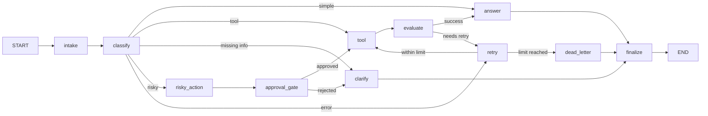

# Day 08 Lab Report — LangGraph Agentic Orchestration

## 1. Team information and reproducibility

| Member | Student ID |
| --- | --- |
| Nguyễn Văn Hải | 2A202601708 |
| Thái Hoài An | 2A202601862 |
| Trần Quang Minh | 2A202601210 |
| [Họ tên thành viên 4] | [MSSV] |
| [Họ tên thành viên 5] | [MSSV] |

- Repository: `hoaianthai345/phase2-k3-4-track3-day8-langgraph-agent`
- Execution command: `make run-scenarios && make grade-local`
- LLM configuration: one of `GEMINI_API_KEY`, `OPENAI_API_KEY`, or `ANTHROPIC_API_KEY` is required. The classifier uses structured output and the response node invokes the configured LLM.

## 2. Architecture

The graph separates normalization, LLM intent classification, tool execution, evaluation, approval, and finalization. Every route ends at `finalize`, so the append-only audit trail always records completion. Retry is bounded by `attempt < max_attempts` before a request goes to `dead_letter`.

## 3. State schema

| Field | Reducer | Purpose |
|---|---|---|
| `messages`, `tool_results`, `errors`, `events` | append (`operator.add`) | Retain auditable history without mutating prior state. |
| `route`, `risk_level`, `attempt`, `evaluation_result` | overwrite | Current routing and retry control values. |
| `pending_question`, `proposed_action`, `approval`, `final_answer` | overwrite | Latest clarification, proposed side effect, review decision, and user-facing result. |

## 4. Scenario results

| Scenario | Expected route | Actual route | Success | Retries | Interrupts |
|---|---|---|---:|---:|---:|
| S01_simple | simple | simple | ✅ | 0 | 0 |
| S02_tool | tool | tool | ✅ | 0 | 0 |
| S03_missing | missing_info | missing_info | ✅ | 0 | 0 |
| S04_risky | risky | risky | ✅ | 0 | 1 |
| S05_error | error | error | ✅ | 2 | 0 |
| S06_delete | risky | risky | ✅ | 0 | 1 |
| S07_dead_letter | error | error | ✅ | 1 | 0 |

| Aggregate metric | Value |
|---|---:|
| Total scenarios | 7 |
| Success rate | 100.00% |
| Average nodes visited | 6.43 |
| Total retries | 3 |
| Total approval/HITL events | 2 |
| State-history replay observed | yes |

## 5. Failure analysis

1. **Transient tool failure:** `evaluate` marks a result containing `ERROR` as `needs_retry`; `retry` increments the counter and `route_after_retry` enforces the maximum. Exhaustion enters `dead_letter` with a transparent final response rather than looping forever.
2. **Risky side effect:** refunds, account deletion, and outgoing emails route to `risky_action` then `approval`. CI uses a deterministic mock approval; setting `LANGGRAPH_INTERRUPT=true` pauses at LangGraph's `interrupt()` and requires a human resume decision.

## 6. Persistence and recovery evidence

Each execution receives a stable `thread_id` (`thread-<scenario_id>`) and compiles with the configured checkpointer. The runner queries `get_state_history()` after each run; the aggregate result above confirms history was available. `make run-scenarios-sqlite` stores a separate real-LLM run in a WAL-enabled SQLite database and writes its validated metric artifact to `outputs/metrics_sqlite.json` (7/7 scenarios passed). The automated persistence test creates a new `SqliteSaver` after a completed run and reads the completed state back from the database, demonstrating recovery beyond a single in-memory graph object.

## 7. Extension work

The submission includes two verified extensions: durable SQLite checkpoint recovery (with WAL mode) and a Mermaid diagram exported directly from the compiled graph via `make export-graph` (`outputs/graph.mmd`). Optional real HITL via `interrupt()` is also available when `LANGGRAPH_INTERRUPT=true`.

## 8. Improvement plan

First, replace the mock tool with authenticated, idempotent support-system tools and validate their schemas. Next, add LLM-as-judge evaluation with offline fixtures, explicit approval roles, and tracing/latency instrumentation for production monitoring.
